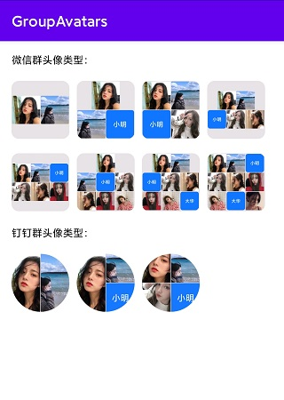

# GroupAvatars

```kotlin
allprojects {
		repositories {
			maven { url 'https://jitpack.io' }
		}
	}
```

```kotlin
dependencies {
	        implementation 'com.github.mtjsoft:GroupAvatars:1.3.0'
	}
```

### use demo

```kotlin
GroupAvatarsLib.init(getBaseContext())
                // 必选，设置最终生成的图片尺寸，单位dp（一般就是当前imageView的大小）
                .setSize(80)
                // 设置钉钉或者微信群头像类型 DingLayoutManager、 WechatLayoutManager
                // 目前钉钉最多组合4个，微信最多9个。超出会自动截取前4或9个
                .setLayoutManager(new WechatLayoutManager())
                // 设置使用昵称生成头像时的背景颜色
                .setNickAvatarColor(R.color.color_1677FF)
                // 设置昵称生成头像时的文字大小 ,单位dp （设置为0时 = 单个小头像的1/4大小）
                .setNickTextSize(0)
                // 设置群组ID，用于生成缓存key
                .setGroupId(groupId)
                // 设置加载最终图片的圆角大小，单位dp，默认0
                .setRound(10)
                // 设置内部单个图片的圆角，单位dp，默认0
                .setChildAvatarRound(3)
                // 单个图片之间的距离，单位dp，默认0dp
                .setGap(1)
                // 设置生成的图片背景色
                .setGapColor(R.color.color_E4E4E4)
                // 单个网络图片加载失败时，会展示默认图片
                .setPlaceholder(R.mipmap.group_default)
                // 设置数据（可设置网络图片地址或者昵称）
                .setDatas(datas)
                // 设置要显示最终图片的ImageView
                .setImageView(imageView)
                .build();
```

### Version
- 1.2.0 修复单个图片的圆角设置问题
- 1.1.0 修改内存缓存、磁盘缓存问题

### 效果展示

